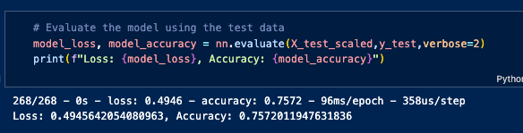

# deep_learning_challenge
Module 21 Challenge

This project explores deep learning model optimization looking at charitable grant applications to Alphapbet Soup.

## Files
- Alphabet_Soup_Applications.ipymb
- AlphabetSoupCharity_Opimization.h5
- AlphabetSoupCharity_Optimization.ipymb
- AlphabetSoupCharity.h5
- Report.md

## Highlights
- original code removed NAME and EIN columns from the database
- optimized code left the NAME column in the data and binned the low-frequency names as 'Other'
- CLASSIFICATION and APPLICATION_TYPE were also modified for low frequency entries to be changed to 'Other"
- All data was scaled using StandardScalar()
- The neural net model utilized only 8 neurons in a relu activation.
- 20 epochs were needed to consistantly performa above the target accuracy of 75%

## Acknoledgements
- This project was created as part of the EdX Data Analytics Bootcamp
- Resources include: XpertLearning Assistant, Bootcamp instructor and TAs

## Author
Andrew Lane, 2025 
[@andrewplane](https://github.com/andrewplane)