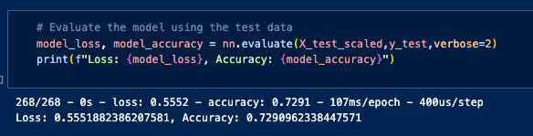

# deep_learning_challenge
Module 21 Challenge
Andrew Lane

## OVERVIEW
Alphabet Soup receives thousands of applications for charitable grants funds. This project endevours to employ deep learning models to analyze data on these applications and their success in the past to predict future success likelyhood on current and future applications.

The available data includes the following for each application:
- EIN
- NAME
- APPLICATION TYPE
- AFFILIATION
- CLASSIFICATION
- USE CASE
- ORGANIZATION (TYPE)
- STATUS (CURRENT)
- INCOME AMOUNT
- SPECIAL CONSIDERATIONS
- ASK AMOUNT
- IS SUCCESSFUL

## RESULTS
- Data Preprocessing
  - The deep learning model is attempting to predict the target variable of IS_SUCCESSFUL
  - All data categories are used at feature variables
  - EIN was removed from the feature variables and NAME was heavily binned to account for the track records of organizations that apply many times

- Compiling, Training, and Evaluating the Model
  - The optimized model utilized one hidden layers of 8 neurons with the 'relu' activation function. The output layer used 1 neuron using the 'sigmoid' activation
  - The neural network was able to achieve an accuracy of 0.757 after only 20 epochs, exceeding the target model performance of 0.75 accuracy
  - Trial an error was used to tune the model. Neuron counts were increased in binary increments (2^x), with layers and epochs added and removed with output changes noted. Adding in the NAME data was key to incorporating applicant organization's track record.

## PRE-OPTIMIZATION RESULTS
- Initial accuracy results in the model were at 73%
- Multiple combinationtion of neurons in increments of 2,4,8,16,32,64,128,256 were used with up to 4 hidden layers. Various activations besides 'relu'. None of these changes produced an accuracy greater than the target of 75%

## SUMMARY
The optimized deep learning model has met the target accruacy requirement of 75% and may be used to evaluate future and current funding requests to predict success.